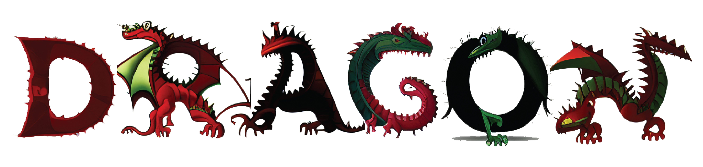
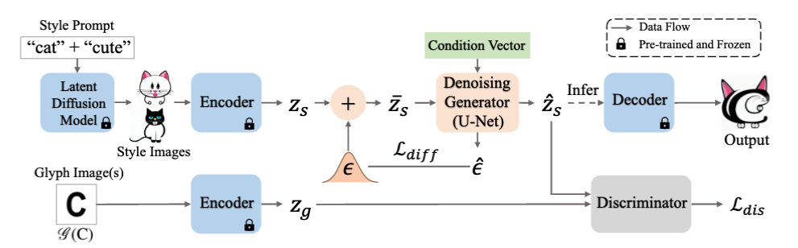
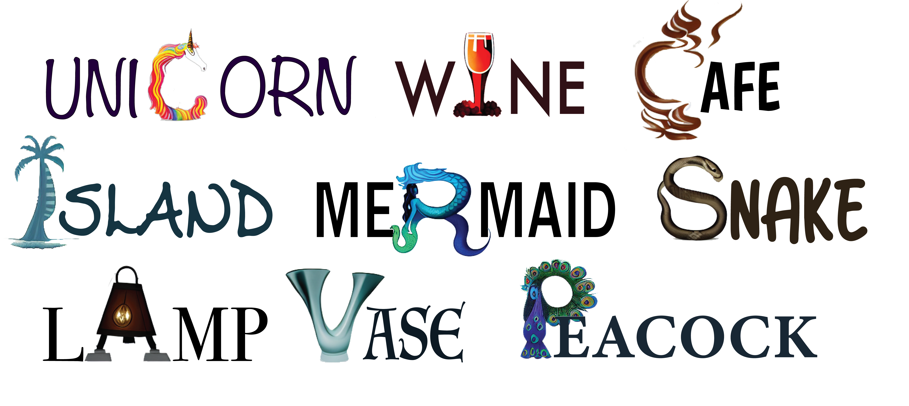

### Implementation of the paper [DS-Fusion: Artistic Typography via Discriminated and Stylized Diffusion](https://arxiv.org/abs/2303.09604)

### Link for project page [DS-Fusion](https://ds-fusion.github.io/)


# DS-Fusion



## PIPELINE 



## Setting up basic environment
Use environment.yaml from the official Stable Diffusion project, to set up the environment. 

```
conda env create -f environment.yaml
```

You will also need to download the checkpoint named "model.ckpt" from [Source](https://github.com/CompVis/latent-diffusion). For ease, we provide an alternative link [Link](https://drive.google.com/file/d/1FuwXUk8Ht-UZ2J-vCAg9MOJRPqd8iY-F/view?usp=sharing) for the checkpoint file we used in our project from the latent-diffusion official source.


## Basic generation

Please run the following script to finetune for a specific style and text. Only single alpha-numeric characters can be accepted. 
For ease of use, some font data has been generated for quick testing. List of these fonts is in ldm/data/list_fonts.py. If you use the name of one of these fonts, please use them with the --one_font argument. Only capital letters and numbers can be used for this purpose, as only they are available pre generated.


```
python script_basic.py -s "DRAGON" -t "R" --one_font "False" --font_name "ani" --white_bg "True" --cartoon "True"   --ckpt_path "ckpt/model.ckpt"
```

```
python txt2img.py --ddim_eta 1.0 --n_samples 6 --n_iter 1 --ddim_steps 50 --scale 5.0 --H 256 --W 256 --outdir out --ckpt  logs/DRAGON-R/checkpoints/last.ckpt --prompt "DRAGON R"
```


- Use command "--make_data True" in finetuning step to override previous generated style images. 
- Set --one_font as False, if wanting to use multiple fonts for use in generation. In this case it would be better to increase max_steps in config to 1000+.
- Add additional style attributes using --attribute in finetuning command. ensure to use the same attributes when generating 

### Custom Font 
- You may use --custom_font and give a name of a font available on your system. In this case you may use any alpha numeric character, provided your system can generate it. 
- You may need to adjust parameters of rasterizing in ldm/data/rasterizer.py because depending on the font, it may not turn out as expected. Look at img_base.png to see what the font looks like rasterized.
- If using --custom_font, add full name including extension. e.g. " --custom_font 'TlwgTypist-Bold.ttf' " 

```
python script_basic.py -s "DRAGON" -t "R" --custom_font "TlwgTypist-Bold.ttf" --white_bg "True" --cartoon "True"  --ckpt_path "ckpt/model.ckpt"
```

```
python txt2img.py --ddim_eta 1.0 --n_samples 6 --n_iter 1 --ddim_steps 50 --scale 5.0 --H 256 --W 256 --outdir out --ckpt  logs/DRAGON-R/checkpoints/last.ckpt --prompt "DRAGON R"
```


## Generating results using pre-trained Generic Use model
A pre-trained model has been trained over all capital letters and numbers, to provide a fast generation. This method was trained using 40 categories (in classes.txt) but has generalized sufficiently to out of training examples.
Please download the checkpoint file from [Link](https://drive.google.com/file/d/1QB-6MK4En07W6Rqs1_Dk9bopFhUpugC4/view?usp=drive_link) and place it in ckpt folder. Write prompt as "style style-attributes letter"
Please make sure the letter is either a capital letter between A-Z or a number 0-9, otherwise it is unlikely to work well.

```
python txt2img.py --use_generic "True" --ddim_eta 1.0 --n_samples 6 --n_iter 1 --ddim_steps 50 --scale 5.0 --H 256 --W 256 --outdir out_generic --ckpt  ckpt/ds-fusion-generic.ckpt --prompt "DRAGON R"
```

## Examples of Results




## Acknowledgement
The implementation is based on Stable Diffusion/Latent Diffusion [Git-Source](https://github.com/CompVis/stable-diffusion). The discriminator structure is referenced from DC-GAN.
    
